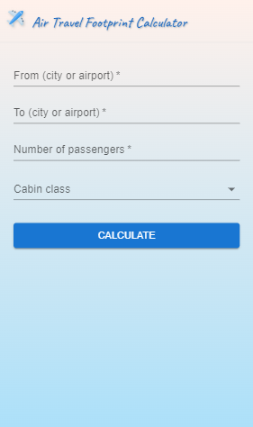
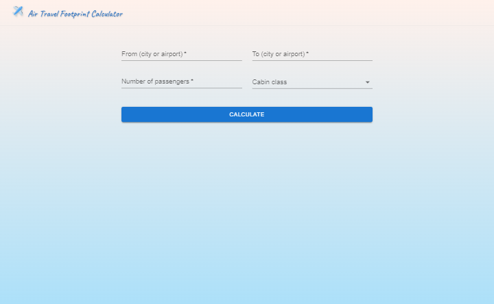
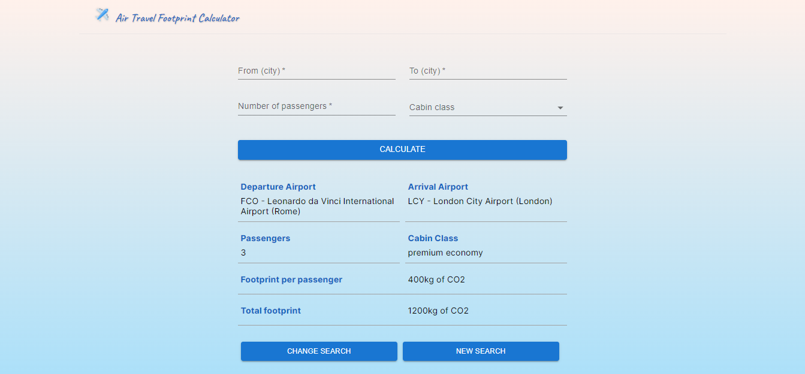

# Air Travel Footprint Calculator

This is the final project from the Front End Development Master offered by the online course provider [Start2Impact](https://www.start2impact.it/).

During the course I had the chance to learn HTML, CSS, Sass, Bootstrap, JavaScript, React, Webpack and Vite.
I decided to complete the course by building a website from scratch using React: a site to calculate the carbon footprint of flights.
I chose this project because I believe that measuring our carbon footprint is the first step to improve and adapt our lifestyle in order to reduce our emissions.

## Link

[Project URL](https://air-travel-footprint.netlify.app/) (hosted on Netlify)

## Screenshot

 

## Project

Users should be able to:

- View the optimal layout for the content depending on their device’s screen size
- Type the name of a city or airport in the from and to input fields to see a list of airports to select from and click/tap on the one they want to select
- Type the number of passengers and select the cabin class
- Click or tap on the "calculate" button to see the footprint of that flight
- See a table with information about the departure and arrival airports, the passenger(s), the cabin class, the footprint per passenger and the total footprint
- Click or tap the "change search" button to be able to change the search queries and search again
- Click or tap the "new search" button to make the results disappear and go back to the top of the page to make a new search

## Built with

- Semantic HTML5 markup
- CSS custom properties and media queries
- [CSS Modules](https://github.com/css-modules/css-modules)
- [Material UI](https://mui.com/)
- JavaScript
- React
- [Vite](https://vitejs.dev/)
- [Amadeus Airport & City Search API](https://developers.amadeus.com/self-service/category/air/api-doc/airport-and-city-search)
- [GoClimate API](https://api.goclimate.com/docs)
- [axios](https://axios-http.com/)
- [Flaticon](https://www.flaticon.com/) for the favicon and the logo
- [React Spinners](https://www.npmjs.com/package/react-spinners)

## Author

Chiara Stefanelli - Front-End Development Student based in Italy

- Website - [Chiara Stefanelli](https://chiarastefanelli.netlify.app/)
- LinkedIn - [Chiara Stefanelli](https://www.linkedin.com/in/chiarastefanelli/?locale=en_US)
- start2impact profile - [Chiara Stefanelli](https://talent.start2impact.it/profile/chiara-stefanelli-13)
